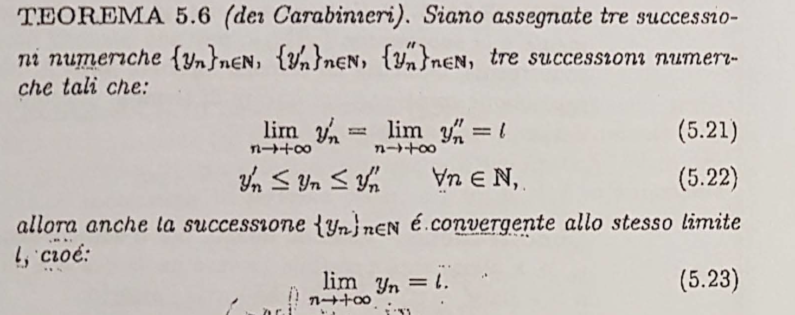

---
title: Analisi1
date: 2023-01-20 00:00:00 -500
categories: [Tech]
tags: [tech]
image_path: /assets/
--- 

- Progressione:
  collapsed:: true
	- Teoria:
	  collapsed:: true
		- Capitoli 2 e 4 da richiamare (insiemi numerici + Funzioni)
		- Capitolo 5, 6 e 7 da studiare (successioni, Limiti, Derivate)
		- Esercizi su Definizioni e enunciati di Teoremi
		- Esercizi su applicazioni della teoria (pratica necessaria)
			- Esami + libro della prof
	- Esercizi:
	  collapsed:: true
		- Priorità su Derivate, Limiti
			- ### Derivate
				- DONE  Regola della somma
				  :LOGBOOK:
				  CLOCK: [2022-11-09 Wed 11:22:30]--[2022-11-09 Wed 11:22:31] =>  00:00:01
				  :END:
				- DONE Regola del prodotto
				- DONE Regola della divisione
				  :LOGBOOK:
				  CLOCK: [2022-11-09 Wed 11:23:57]--[2022-11-09 Wed 11:24:01] =>  00:00:04
				  :END:
				- Regola dell'inverso #card
				  card-last-interval:: 4.43
				  card-repeats:: 1
				  card-ease-factor:: 2.6
				  card-next-schedule:: 2023-01-20T19:33:09.589Z
				  card-last-reviewed:: 2023-01-16T09:33:09.589Z
				  card-last-score:: 5
				  :LOGBOOK:
				  CLOCK: [2022-11-09 Wed 11:32:10]--[2022-11-09 Wed 11:32:11] =>  00:00:01
				  CLOCK: [2022-11-09 Wed 11:32:12]
				  :END:
					- $[{1 \over{f(x)}}]' = {-f'(x)\over {[f(x)]}^2}$
				- Regola Funzioni Composte #card
				  card-last-interval:: 4
				  card-repeats:: 2
				  card-ease-factor:: 2.7
				  card-next-schedule:: 2023-01-17T10:45:34.963Z
				  card-last-reviewed:: 2023-01-13T10:45:34.964Z
				  card-last-score:: 5
				  :LOGBOOK:
				  CLOCK: [2022-11-09 Wed 11:35:57]
				  :END:
					- $[f(g(x))]' = f'(g(x)) \cdot g'(x)$
				- Regola Funzione Esponenziale #card
				  card-last-interval:: 4
				  card-repeats:: 1
				  card-ease-factor:: 2.36
				  card-next-schedule:: 2023-01-17T10:38:12.291Z
				  card-last-reviewed:: 2023-01-13T10:38:12.292Z
				  card-last-score:: 3
					- $[f(x)]^{g(x)}$ si deriva come $e^{g(x) \cdot ln(f(x))}$
		- Possibilità di esercizi su massimo e minimo / INSIEMI
		- Possibilità di esercizi su invertibilità
- ## **CAPITOLO 2 - INSIEMI NUMERICI**
	- Intervalli Limitati e Illimitati #card
	  card-last-interval:: 4
	  card-repeats:: 2
	  card-ease-factor:: 2.22
	  card-next-schedule:: 2023-01-17T10:44:54.466Z
	  card-last-reviewed:: 2023-01-13T10:44:54.468Z
	  card-last-score:: 3
	  collapsed:: true
		- 
	- Intorno di un punto #card
	  card-last-interval:: 4
	  card-repeats:: 2
	  card-ease-factor:: 2.22
	  card-next-schedule:: 2023-01-22T13:59:16.729Z
	  card-last-reviewed:: 2023-01-18T13:59:16.729Z
	  card-last-score:: 3
	  collapsed:: true
		- 
	- Massimo di un insieme #card
	  card-last-interval:: 4
	  card-repeats:: 2
	  card-ease-factor:: 2.46
	  card-next-schedule:: 2023-01-17T10:44:23.683Z
	  card-last-reviewed:: 2023-01-13T10:44:23.683Z
	  card-last-score:: 5
	  collapsed:: true
		- 
	- Unicità del massimo #card
	  card-last-interval:: 4.43
	  card-repeats:: 1
	  card-ease-factor:: 2.6
	  card-next-schedule:: 2023-01-18T22:20:20.916Z
	  card-last-reviewed:: 2023-01-14T12:20:20.917Z
	  card-last-score:: 5
	  collapsed:: true
		- 
	- Maggiorante e Minorante #card
	  collapsed:: true
		- 
	- Estremi di insiemi Limitati #card
	  card-last-interval:: 4.27
	  card-repeats:: 1
	  card-ease-factor:: 2.36
	  card-next-schedule:: 2023-01-17T16:48:05.485Z
	  card-last-reviewed:: 2023-01-13T10:48:05.486Z
	  card-last-score:: 3
	  collapsed:: true
		- 
	- Teorema della Limitatezza di un insieme #card
	  card-last-interval:: 4.14
	  card-repeats:: 1
	  card-ease-factor:: 2.6
	  card-next-schedule:: 2023-01-22T17:10:27.762Z
	  card-last-reviewed:: 2023-01-18T14:10:27.762Z
	  card-last-score:: 5
	  collapsed:: true
		- 
- ## **CAPITOLO 4 - FUNZIONI**
	- Definizione di Funzione Iniettiva #card
	  card-last-interval:: 4
	  card-repeats:: 1
	  card-ease-factor:: 2.6
	  card-next-schedule:: 2023-01-23T11:44:09.236Z
	  card-last-reviewed:: 2023-01-19T11:44:09.237Z
	  card-last-score:: 5
	  collapsed:: true
		- 
	- Definizione di Funzione Suriettiva #card
	  card-last-interval:: 4
	  card-repeats:: 1
	  card-ease-factor:: 2.6
	  card-next-schedule:: 2023-01-23T11:45:08.042Z
	  card-last-reviewed:: 2023-01-19T11:45:08.042Z
	  card-last-score:: 5
	  collapsed:: true
		- 
	- Funzione Pari - Dispari - Periodica #card
	  card-last-interval:: 4.43
	  card-repeats:: 1
	  card-ease-factor:: 2.6
	  card-next-schedule:: 2023-01-18T23:39:50.721Z
	  card-last-reviewed:: 2023-01-14T13:39:50.721Z
	  card-last-score:: 5
	  collapsed:: true
		- 
	- Definizione Funzione inversa #card
	  collapsed:: true
		- 
	- Definizione Funzione Limitata #card
	  card-last-interval:: 4
	  card-repeats:: 1
	  card-ease-factor:: 2.6
	  card-next-schedule:: 2023-01-23T11:51:44.600Z
	  card-last-reviewed:: 2023-01-19T11:51:44.600Z
	  card-last-score:: 5
	  collapsed:: true
		- 
	- Definizione Funzione Lineare #card
	  card-last-interval:: 4
	  card-repeats:: 1
	  card-ease-factor:: 2.6
	  card-next-schedule:: 2023-01-23T11:54:28.819Z
	  card-last-reviewed:: 2023-01-19T11:54:28.820Z
	  card-last-score:: 5
	  collapsed:: true
		- 
	- Una Funzione Lineare è Monotona per quali valori di $a$ #card
	  card-last-interval:: 4
	  card-repeats:: 2
	  card-ease-factor:: 2.7
	  card-next-schedule:: 2023-01-17T10:45:29.162Z
	  card-last-reviewed:: 2023-01-13T10:45:29.163Z
	  card-last-score:: 5
	  collapsed:: true
		- 
	- Definizione Funzione Parte intera di x #card
	  card-last-interval:: 3.86
	  card-repeats:: 1
	  card-ease-factor:: 2.36
	  card-next-schedule:: 2023-01-22T09:59:22.071Z
	  card-last-reviewed:: 2023-01-18T13:59:22.071Z
	  card-last-score:: 3
	  collapsed:: true
		- 
	- Definizione Funzione Quadratica #card
	  card-last-interval:: 4
	  card-repeats:: 1
	  card-ease-factor:: 2.36
	  card-next-schedule:: 2023-01-17T10:40:56.212Z
	  card-last-reviewed:: 2023-01-13T10:40:56.213Z
	  card-last-score:: 3
	  collapsed:: true
		- 
	- Definizione funzione segno. è pari o dispari? è limitata o no? Qual è il suo dominio? #card
	  card-last-interval:: 4
	  card-repeats:: 1
	  card-ease-factor:: 2.36
	  card-next-schedule:: 2023-01-17T10:41:29.844Z
	  card-last-reviewed:: 2023-01-13T10:41:29.844Z
	  card-last-score:: 3
	  collapsed:: true
		- 
		- 
	- Definizione Funzione Monotona #card
	  card-last-interval:: 4
	  card-repeats:: 1
	  card-ease-factor:: 2.6
	  card-next-schedule:: 2023-01-23T12:04:18.480Z
	  card-last-reviewed:: 2023-01-19T12:04:18.480Z
	  card-last-score:: 5
	  collapsed:: true
		- 
		- 
	- Enunciare la Definizione del numero di Nepero #card
	  card-last-interval:: 4
	  card-repeats:: 2
	  card-ease-factor:: 2.46
	  card-next-schedule:: 2023-01-23T11:48:56.057Z
	  card-last-reviewed:: 2023-01-19T11:48:56.058Z
	  card-last-score:: 5
	  collapsed:: true
		- 
	- Definizione Punto di Massimo Assoluto per $f$ #card
	  card-last-interval:: 4.28
	  card-repeats:: 1
	  card-ease-factor:: 2.6
	  card-next-schedule:: 2023-01-17T16:50:10.066Z
	  card-last-reviewed:: 2023-01-13T10:50:10.066Z
	  card-last-score:: 5
	  collapsed:: true
		- 
	- Definizione Punto di Massimo Relativo per $f$ #card
	  card-last-interval:: 4.43
	  card-repeats:: 1
	  card-ease-factor:: 2.6
	  card-next-schedule:: 2023-01-18T23:43:19.343Z
	  card-last-reviewed:: 2023-01-14T13:43:19.344Z
	  card-last-score:: 5
	  collapsed:: true
		- 
	- Dal punto di vista geometrico quando $f$ ha inversa? #card
	  collapsed:: true
		- 
	- Che proprietà ha il grafico di $f^{-1}$ rispetto ad $f$? #card
	  card-last-interval:: 4.42
	  card-repeats:: 1
	  card-ease-factor:: 2.36
	  card-next-schedule:: 2023-01-20T19:38:34.367Z
	  card-last-reviewed:: 2023-01-16T09:38:34.368Z
	  card-last-score:: 3
	  collapsed:: true
		- 
	- Come si trova l'espressione della funzione inversa? #card
	  collapsed:: true
		- 
	- Quali sono le 4 operazioni di Trasformazione Geometrica? #card
	  card-last-interval:: -1
	  card-repeats:: 1
	  card-ease-factor:: 2.5
	  card-next-schedule:: 2023-01-18T23:00:00.000Z
	  card-last-reviewed:: 2023-01-18T14:09:28.881Z
	  card-last-score:: 1
	  collapsed:: true
		- 
		- 
		- 
		- 
- ## **CAPITOLO 5 - SUCCESSIONI NUMERICHE**
	- Definisci i tipi di Successioni Monotone #card
	  card-last-interval:: 4.14
	  card-repeats:: 1
	  card-ease-factor:: 2.6
	  card-next-schedule:: 2023-01-22T16:59:44.727Z
	  card-last-reviewed:: 2023-01-18T13:59:44.727Z
	  card-last-score:: 5
	  collapsed:: true
		- 
	- Definizione Punto di Accumulazione #card
	  card-last-interval:: 4.27
	  card-repeats:: 1
	  card-ease-factor:: 2.36
	  card-next-schedule:: 2023-01-20T15:28:57.193Z
	  card-last-reviewed:: 2023-01-16T09:28:57.194Z
	  card-last-score:: 3
	  collapsed:: true
		- 
	- Definizione Insieme Derivato di un Insieme $A$ #card
	  card-last-interval:: 4.27
	  card-repeats:: 1
	  card-ease-factor:: 2.36
	  card-next-schedule:: 2023-01-20T15:32:56.123Z
	  card-last-reviewed:: 2023-01-16T09:32:56.123Z
	  card-last-score:: 3
	  collapsed:: true
		- 
	- Dimostra che $x=0$ è un Punto di Accumulazione per la successione $x = {1\over n}$ #card
	  collapsed:: true
		- 
	- Dimostra che $+\infty$ è un punto di accumulazione per l'insieme $A \subset \R$ #card
	  card-last-interval:: -1
	  card-repeats:: 1
	  card-ease-factor:: 2.5
	  card-next-schedule:: 2023-01-13T23:00:00.000Z
	  card-last-reviewed:: 2023-01-13T10:14:55.319Z
	  card-last-score:: 1
	  collapsed:: true
		- 
	- Quando possiamo dire che una successione numerica converge ad un limite finito $l$ ? #card
	  card-last-interval:: 4.27
	  card-repeats:: 1
	  card-ease-factor:: 2.36
	  card-next-schedule:: 2023-01-18T18:02:50.817Z
	  card-last-reviewed:: 2023-01-14T12:02:50.881Z
	  card-last-score:: 3
	  collapsed:: true
		- 
	- Quando possiamo dire che una successione diverge? #card
	  card-last-interval:: 4.27
	  card-repeats:: 1
	  card-ease-factor:: 2.36
	  card-next-schedule:: 2023-01-18T18:25:36.882Z
	  card-last-reviewed:: 2023-01-14T12:25:36.883Z
	  card-last-score:: 3
	  collapsed:: true
		- 
	- Quando si dice che una successione è regolare? #card
	  card-last-interval:: 4.27
	  card-repeats:: 1
	  card-ease-factor:: 2.36
	  card-next-schedule:: 2023-01-18T19:44:36.430Z
	  card-last-reviewed:: 2023-01-14T13:44:36.431Z
	  card-last-score:: 3
	  collapsed:: true
		- 
	- Una successione regolare possiede un unico limite. Come si dimostra?#card
	  card-last-interval:: 4
	  card-repeats:: 2
	  card-ease-factor:: 2.46
	  card-next-schedule:: 2023-01-23T11:48:49.811Z
	  card-last-reviewed:: 2023-01-19T11:48:49.812Z
	  card-last-score:: 5
	  collapsed:: true
		- Per Assurdo
		- 
	- Definizione Successioni Estratte #card
	  collapsed:: true
		- 
	- Enuncia due teoremi sulle Successioni Estratte #card
	  collapsed:: true
		- 
		- 
	- Enuncia il **teorema dei carabinieri** #card
	  card-last-interval:: 4.42
	  card-repeats:: 1
	  card-ease-factor:: 2.36
	  card-next-schedule:: 2023-01-20T19:36:47.584Z
	  card-last-reviewed:: 2023-01-16T09:36:47.585Z
	  card-last-score:: 3
	  collapsed:: true
		- 
	- Enuncia il **teorema del confronto** #card
	  collapsed:: true
		- 
	- Enuncia il **teorema della permanenza del segno** #card
	  collapsed:: true
		- 
	- Enuncia il teorema della convergenza di Cauchy #card
	  card-last-interval:: -1
	  card-repeats:: 1
	  card-ease-factor:: 2.36
	  card-next-schedule:: 2023-01-18T23:00:00.000Z
	  card-last-reviewed:: 2023-01-18T14:02:18.692Z
	  card-last-score:: 1
	  collapsed:: true
		- 
- ## CAPITOLO 6 - LIMITI DI SUCCESSIONE
	- Definizione di Limite per $x$->$x_0$ #card
	  card-last-interval:: 3.45
	  card-repeats:: 2
	  card-ease-factor:: 2.36
	  card-next-schedule:: 2023-01-22T00:05:29.761Z
	  card-last-reviewed:: 2023-01-18T14:05:29.761Z
	  card-last-score:: 3
	  collapsed:: true
		- 
	- Condizione Necessaria e sufficiente che una funzione ammetta limite finito #card
	  card-last-interval:: 4
	  card-repeats:: 1
	  card-ease-factor:: 2.36
	  card-next-schedule:: 2023-01-17T10:39:32.381Z
	  card-last-reviewed:: 2023-01-13T10:39:32.381Z
	  card-last-score:: 3
	  collapsed:: true
		- 
	- Enuncia il Teorema dell'unicità di un limite #card
	  card-last-interval:: -1
	  card-repeats:: 1
	  card-ease-factor:: 2.5
	  card-next-schedule:: 2023-01-19T23:00:00.000Z
	  card-last-reviewed:: 2023-01-19T11:42:06.252Z
	  card-last-score:: 1
	- Quando una funzione è infinitamente grande? #card
	  card-last-interval:: 4
	  card-repeats:: 1
	  card-ease-factor:: 2.36
	  card-next-schedule:: 2023-01-22T13:56:13.473Z
	  card-last-reviewed:: 2023-01-18T13:56:13.476Z
	  card-last-score:: 3
	  collapsed:: true
		- 
	- Enuncia il teorema dei carabinieri #card
	  card-last-interval:: 4.42
	  card-repeats:: 1
	  card-ease-factor:: 2.36
	  card-next-schedule:: 2023-01-20T19:36:50.804Z
	  card-last-reviewed:: 2023-01-16T09:36:50.804Z
	  card-last-score:: 3
	- Enuncia il teorema della convergenza di Cauchy #card
	- Definizione funzione continua in un punto #card
	  card-last-interval:: 4
	  card-repeats:: 2
	  card-ease-factor:: 2.7
	  card-next-schedule:: 2023-01-17T10:50:23.769Z
	  card-last-reviewed:: 2023-01-13T10:50:23.770Z
	  card-last-score:: 5
	  collapsed:: true
		- 
	- Definizione funzione continua in un intervallo #card
	  card-last-interval:: 4
	  card-repeats:: 1
	  card-ease-factor:: 2.6
	  card-next-schedule:: 2023-01-23T11:47:57.048Z
	  card-last-reviewed:: 2023-01-19T11:47:57.049Z
	  card-last-score:: 5
	  collapsed:: true
		- 
	- Teorema della permanenza del Segno #card
	  card-last-interval:: -1
	  card-repeats:: 1
	  card-ease-factor:: 2.5
	  card-next-schedule:: 2023-01-18T23:00:00.000Z
	  card-last-reviewed:: 2023-01-18T14:09:23.698Z
	  card-last-score:: 1
	  collapsed:: true
		- 
	- Teorema dell'esistenza degli zeri #card
	  card-last-interval:: 4
	  card-repeats:: 2
	  card-ease-factor:: 2.46
	  card-next-schedule:: 2023-01-17T10:45:20.843Z
	  card-last-reviewed:: 2023-01-13T10:45:20.844Z
	  card-last-score:: 5
	  collapsed:: true
		- 
	- Teorema di Weierstrass #card
	  card-last-interval:: 10.24
	  card-repeats:: 3
	  card-ease-factor:: 2.56
	  card-next-schedule:: 2023-01-23T15:50:18.668Z
	  card-last-reviewed:: 2023-01-13T10:50:18.668Z
	  card-last-score:: 5
	  collapsed:: true
		- 
	- Discontinuità eliminabile e Specie di discontinuità #card
	  card-last-interval:: 4
	  card-repeats:: 1
	  card-ease-factor:: 2.36
	  card-next-schedule:: 2023-01-17T10:26:16.241Z
	  card-last-reviewed:: 2023-01-13T10:26:16.243Z
	  card-last-score:: 3
	  collapsed:: true
		- 
		- 
	- Ordine degli infiniti #card
	  card-last-interval:: 4
	  card-repeats:: 1
	  card-ease-factor:: 2.6
	  card-next-schedule:: 2023-01-17T10:31:08.684Z
	  card-last-reviewed:: 2023-01-13T10:31:08.685Z
	  card-last-score:: 5
	  collapsed:: true
		- 
- ## CAPITOLO 7 - STUDIO DI FUNZIONE
	- Quali sono i 7 passi dello studio di funzione? #card
	  card-last-interval:: 3.86
	  card-repeats:: 1
	  card-ease-factor:: 2.36
	  card-next-schedule:: 2023-01-22T09:59:26.154Z
	  card-last-reviewed:: 2023-01-18T13:59:26.155Z
	  card-last-score:: 3
		- 1. Ricerca e studio del Dominio (**INSIEME DI DEFINIZIONE**)
		  2. Ricerca punti di **intersezione con gli assi** coordinati e **STUDIO DEL SEGNO**
		  3. Individuazione di **SIMMETRIE NOTEVOLI**
		  4. **Comportamento agli estremi del Dominio**, ricerca asintoti, classificazione dei punti di discontinuità
		  5. **Studio della monotonia**, ricerca punti di estremo, classificazione punti di non derivabilità
		  6. **Studio della concavità** e ricerca di flessi
	- Definizione concetto di derivata #card
	  card-last-interval:: 4.43
	  card-repeats:: 1
	  card-ease-factor:: 2.6
	  card-next-schedule:: 2023-01-18T22:06:59.405Z
	  card-last-reviewed:: 2023-01-14T12:06:59.406Z
	  card-last-score:: 5
	  collapsed:: true
		- 
	- Definizione punti angolosi e cuspidali #card
	  card-last-interval:: 4.27
	  card-repeats:: 1
	  card-ease-factor:: 2.36
	  card-next-schedule:: 2023-01-18T18:15:18.110Z
	  card-last-reviewed:: 2023-01-14T12:15:18.110Z
	  card-last-score:: 3
	  collapsed:: true
		- 
	- Teorema su derivata di funzione reale #card
	  card-last-interval:: -1
	  card-repeats:: 1
	  card-ease-factor:: 2.5
	  card-next-schedule:: 2023-01-14T23:00:00.000Z
	  card-last-reviewed:: 2023-01-14T12:27:17.916Z
	  card-last-score:: 1
		- 
	- Definizione del differenziale #card
	  card-last-interval:: -1
	  card-repeats:: 1
	  card-ease-factor:: 2.5
	  card-next-schedule:: 2023-01-14T23:00:00.000Z
	  card-last-reviewed:: 2023-01-14T13:36:55.424Z
	  card-last-score:: 1
	  collapsed:: true
		- 
	- Teorema di Lagrange #card
	  card-last-interval:: 4
	  card-repeats:: 2
	  card-ease-factor:: 2.46
	  card-next-schedule:: 2023-01-20T09:33:00.536Z
	  card-last-reviewed:: 2023-01-16T09:33:00.536Z
	  card-last-score:: 5
	  collapsed:: true
		- 
	- Teorema di Rolle #card
	  card-last-interval:: 4.27
	  card-repeats:: 1
	  card-ease-factor:: 2.36
	  card-next-schedule:: 2023-01-20T15:23:47.570Z
	  card-last-reviewed:: 2023-01-16T09:23:47.571Z
	  card-last-score:: 3
	  collapsed:: true
		- 
	- Definizione Funzione Primitiva #card
	  collapsed:: true
		- 
	- Regola di De L'Hopital #card
	  card-last-interval:: 4.14
	  card-repeats:: 1
	  card-ease-factor:: 2.6
	  card-next-schedule:: 2023-01-22T17:09:53.648Z
	  card-last-reviewed:: 2023-01-18T14:09:53.648Z
	  card-last-score:: 5
	  collapsed:: true
		- 
	- Forme indeterminate #card
	  card-last-interval:: 4
	  card-repeats:: 2
	  card-ease-factor:: 2.6
	  card-next-schedule:: 2023-01-23T11:42:11.194Z
	  card-last-reviewed:: 2023-01-19T11:42:11.195Z
	  card-last-score:: 5
	  collapsed:: true
		- 
		  id:: 63bff2d0-6f6c-4564-83ab-25e04344ce1b
		- 
	- Relazione Asintoti e Crescenza #card
	  card-last-interval:: 4.27
	  card-repeats:: 1
	  card-ease-factor:: 2.36
	  card-next-schedule:: 2023-01-20T15:18:25.617Z
	  card-last-reviewed:: 2023-01-16T09:18:25.618Z
	  card-last-score:: 3
	  collapsed:: true
		- 
		- 
	- Min e Max Relativi #card
	  card-last-interval:: 4.27
	  card-repeats:: 1
	  card-ease-factor:: 2.36
	  card-next-schedule:: 2023-01-20T15:01:04.019Z
	  card-last-reviewed:: 2023-01-16T09:01:04.019Z
	  card-last-score:: 3
	  collapsed:: true
		- 
	- Concavità e Flessi #card
	  card-last-interval:: 4.27
	  card-repeats:: 1
	  card-ease-factor:: 2.36
	  card-next-schedule:: 2023-01-20T15:07:24.135Z
	  card-last-reviewed:: 2023-01-16T09:07:24.136Z
	  card-last-score:: 3
	  collapsed:: true
		- 
		- 
	- Taylor #card
	  card-last-interval:: 4
	  card-repeats:: 2
	  card-ease-factor:: 2.7
	  card-next-schedule:: 2023-01-22T13:59:32.522Z
	  card-last-reviewed:: 2023-01-18T13:59:32.522Z
	  card-last-score:: 5